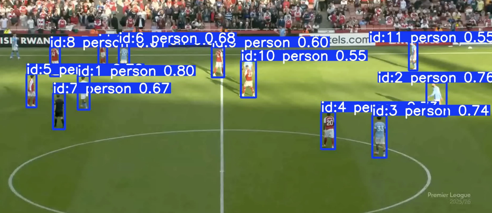

## First steps

First thing is to get a game. I used the Arsenal vs Man City game becasuse I am able to download it, I watched it, and I don't like Man city.

First, we split that up into 10s chunks, to make the overall development easier

Initial object detection:

I tried the initial object detection from ultralytics, and it classifies the players pretty well, but fails on the ball. this will be a major challenge. I will probably have to fine tune a model to pick up the ball, which means either picking up a pre-trained model tha can do that (like Obects365, even though it has many many classes and is large). Maybe I can create a example of this dataset, but filtered to only the classes i care about. An example of the outputs is here:

An example from online (sorry i can't remember where :( ) also sometimes predicts the ball, but it is very intermittant. The ball detection is potentially the most difficult part of this whole process. I will probably use the ultralyics training framwork because it is largely easy

## Clustering

Next I wanted to the try the clustering. I thought fiftyone would also be a good data visualiasation, so here we go.

This is largely working in resnet_clustering even though I am using fiftyones build in compute_visualisation. This is painful because it has to generate frames (fair enough) but also seems to run on my laptop cpu, which is sloooow. However, it does prove the point and it mostly works. There are some exmples such as on corners, or when there is significant crowd, that the clustering is less clear.

The options then would be:
1) Training a classifier?
2) Do some kind of detection for pitch/crowd etc

There is also some general pain around using the videos both within Voxel51 for visualising etc. Probably easier for debugging purposes to treat each image independently and use them and
