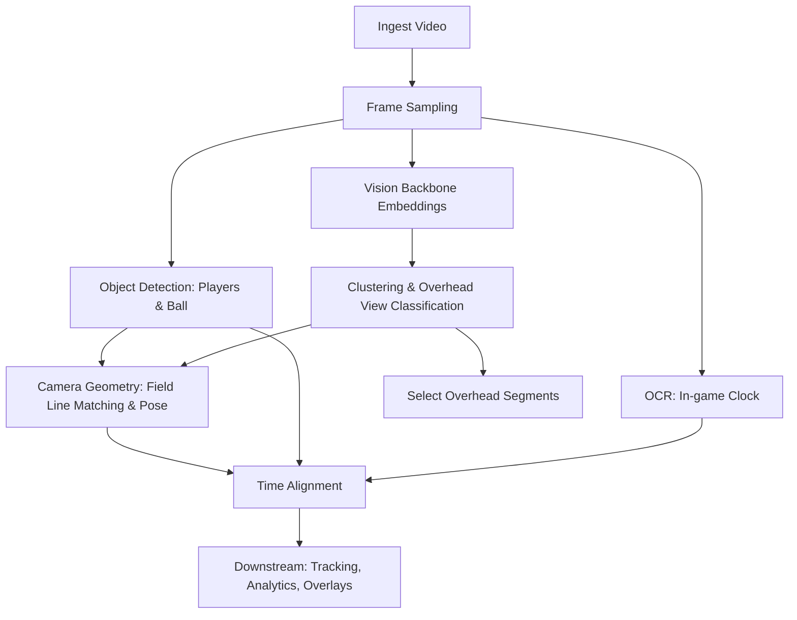

# Video Processing Pipelines

This document describes how a football broadcast video is processed end-to-end. It focuses on the sequence of stages, their inputs/outputs, and how they run in parallel. Implementation details are intentionally omitted.

## Goals

- Identify frames/scenes that correspond to the “overhead (tactical) shot”
- Extract the in-game clock via OCR
- Detect players and ball
- Estimate camera geometry by matching field lines and computing a field-aligned transform
- Produce time-aligned outputs that downstream stages can consume (tracking, analytics, overlays)

## High-level flow

- Ingest video and standardize it (fps, resolution, codec)
- Sample frames and compute visual embeddings with a vision backbone
- Cluster frames by embeddings to identify overhead views
- In parallel, run OCR to decode the in-game clock
- In parallel, run fine-tuned object detection for players and ball
- In parallel, estimate camera pose by matching field lines and computing homography/geometry
- Synchronize all branches by timestamps and hand off to subsequent stages (e.g., tracking, analytics)

## Stage 0 — Ingestion and pre-processing

Input
- Single video file or directory of pre-split segments

Process
- Normalize fps and resolution (optional but recommended)
- Generate basic metadata (duration, frame count, fps)
- If very long, split into segments (e.g., n-minute chunks) for parallelism

Output
- Standardized video (or segments)
- Metadata JSON (fps, duration, segment boundaries)

## Stage 1 — Frame sampling and embeddings (Backbone)

Input
- Standardized video or segments

Process
- Sample frames at a configured rate (e.g., 1–2 fps for global scene clustering)
- Compute feature embeddings with a vision backbone (e.g., ResNet/CLIP/Vit). Store per-frame embedding vectors with timestamps

Output
- Frame index with: {timestamp, frame_id, embedding}

## Stage 2 — Clustering and overhead-shot classification

Input
- Frame embeddings

Process
- Cluster embeddings (e.g., k-means/DBSCAN/HDBSCAN)
- Identify cluster(s) corresponding to the overhead view (e.g., via similarity to learned prototypes or centroid-distance heuristics)
- Optionally refine with a lightweight classifier trained to distinguish overhead vs non-overhead

Output
- Per-frame labels: {is_overhead: bool, confidence}
- Overhead segments: contiguous time ranges when is_overhead is true

## Stage 3 — OCR for in-game clock (parallel)

Input
- Sampled frames (or low-rate crops of expected clock region)

Process
- Detect and/or crop the scoreboard/clock region
- Run OCR to decode the clock string (e.g., mm:ss or mm:ss + half)
- Apply temporal smoothing, error correction, and monotonicity constraints

Output
- Time series: {timestamp -> game_clock}
- Confidence scores and missing/uncertain markers

## Stage 4 — Object detection (players and ball) (parallel)

Input
- Frames (full-res or downscaled); ideally restricted to overhead segments for efficiency

Process
- Run a fine-tuned detection model (e.g., YOLO) for classes: player, ball, referee, goalkeeper
- Produce bounding boxes with confidence and class
- Optional: instance appearance descriptors for downstream tracking

Output
- Detections per frame: [{bbox, class, conf, timestamp}]

## Stage 5 — Camera geometry (parallel)

Input
- Frames (preferably those labeled as overhead)

Process
- Detect field lines, circles, arcs (e.g., Hough + learned line segments)
- Match against a canonical pitch model to estimate homography and camera pose
- Use RANSAC/robust fitting to handle outliers
- Optionally compute per-frame transforms to normalized field coordinates

Output
- Per-frame geometry: {H (image->field), inliers, quality metrics}
- Camera pose over time, when available

## Stage 6 — Synchronization and handoff

Input
- Overhead labels, OCR time series, detections, camera geometry

Process
- Align by timestamps and segment boundaries
- Resolve conflicts and propagate uncertainties (e.g., prefer overhead-only outputs for geometry-dependent tasks)
- Produce unified, time-indexed records for downstream steps

Output
- Consolidated timeline with: {game_clock, is_overhead, detections, geometry}
- Ready for tracking, identity stitching, team assignment, event detection, analytics

## Data model (proposed)

- video.json
  - fps, duration, segments
- frames.parquet
  - frame_id, timestamp, is_overhead, overhead_conf
- embeddings.parquet
  - frame_id, embedding (vector)
- ocr_clock.parquet
  - timestamp, game_clock, conf
- detections.parquet
  - frame_id, timestamp, class, bbox(xywh), conf
- geometry.parquet
  - frame_id, timestamp, H(3x3 flattened), quality, inliers

## Processing of a new video (example)

1) Ingest video; optionally split into N-minute segments for parallelism
2) Sample frames at 1–2 fps; compute embeddings and cluster to label overhead frames
3) In parallel
   - OCR: read the in-game clock from each sampled frame and smooth over time
   - Object detection: run the player/ball detector; store per-frame boxes
   - Camera geometry: on overhead frames, fit homography to pitch model and store transforms
4) Synchronize by timestamps; emit a consolidated timeline for downstream tasks (tracking, analytics, overlays)

## Parallelism and orchestration

- The pipeline branches from sampled frames into three parallel paths: OCR, detection, and geometry
- Overhead classification can gate geometry estimation and optionally gate detection to save compute
- Branch results are joined by timestamp; missing data is handled gracefully with confidence/quality fields
- Orchestration can be implemented with a workflow engine (e.g., Metaflow) to schedule parallel steps and joins

## Quality, monitoring, and fallback

- Persist per-stage quality metrics (OCR confidence, clustering silhouette score, geometry inlier ratios)
- Define thresholds and fallbacks (e.g., if geometry fails, skip field-projected analytics for that window)
- Log timing and throughput for each stage to guide optimization

## Outputs for downstream stages

- Tracking: use detections + embeddings to produce identities and trajectories
- Team assignment: color/cluster-based team ID + goalie detection
- Event detection: possession changes, shots, goals, set-pieces
- Visual overlays: project detections onto a canonical field view using H

---

This document will evolve as models and contracts stabilize. The focus here is the data flow and stage responsibilities to enable independent development and testing of each component.
