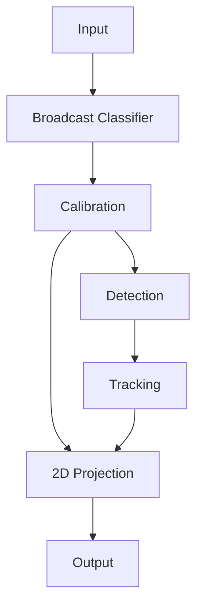

# Footy Scan — System Design

Status: **LIVING DOCUMENT** · Issue: footy_track-y5g

This is the **guiding reference** for the footy-track / Footy Scan pipeline.
Every component-level design doc (e.g. tracker output format, calibration,
event extraction) should slot into one of the stages defined here and link
back to this document.

If you are looking for:

- **Module-level architecture, data models, and time conventions** —
  [`system_overview.md`](system_overview.md) is the reference.
- **A narrative tour of the existing per-stage pipelines (frame
  embeddings, OCR, geometry)** — [`pipelines.md`](pipelines.md).
- **The historical pipeline-architecture summary** —
  [`pipeline_architecture.md`](pipeline_architecture.md).

This document supersedes those for the question *"what are the stages,
in what order, and what does each one consume / produce?"*

---

## 1. Pipeline at a glance

The system is a linear chain of seven stages. Earlier stages can run as
batch passes over a video; later stages can be added without rewriting
upstream stages.

```
        ┌──────────┐
        │  Input   │   video file or live stream
        └────┬─────┘
             │ frames + GameTime
             ▼
   ┌────────────────────┐
   │ Broadcast          │   per-frame: is this a usable broadcast view?
   │ Classifier         │
   └────┬───────────────┘
        │ broadcast frames only
        ▼
   ┌────────────────────┐
   │ Calibration        │   per-frame homography image → pitch
   │ (camera geometry)  │
   └────┬───────────────┘
        │ frames + H matrix
        ▼
   ┌────────────────────┐
   │ Detection          │   per-frame object boxes (player, ball, …)
   └────┬───────────────┘
        │ FrameDetections
        ▼
   ┌────────────────────┐
   │ Tracking           │   persistent track IDs across frames
   └────┬───────────────┘
        │ Track / Detection rows
        ▼
   ┌────────────────────┐
   │ 2D Projection      │   image-space boxes → pitch-space (x, y) per
   │                    │   track per frame
   └────┬───────────────┘
        │ pitch-space trajectories
        ▼
        ┌──────────┐
        │  Output  │   Parquet / JSON / FiftyOne / footy-stats
        └──────────┘
```



The **Calibration** branch feeds **2D Projection** directly so that the
homography is available alongside tracked detections at projection time.
A non-broadcast frame short-circuits the chain: it is recorded but
detection / tracking are skipped (see §2.2).

---

## 2. Stages

Each stage is documented with: **purpose**, **input**, **output**,
**status** (implemented / partial / planned), and **link** to its design
doc when one exists.

### 2.1 Input

**Purpose**: ingest a football video (file or live stream), decode
frames, and stamp each with `GameTime` plus any video metadata.

| Aspect | Detail |
|---|---|
| Input | Video file (mp4 / mkv / …) or live stream URL |
| Output | Stream of `(frame_image, GameTime, video_metadata)` |
| Canonical timestamp | `GameTime` is converted to `ContinuousTime` at the boundary — see [`timings.md`](timings.md) |
| Status | **Partial** — extraction implemented in `scripts/extract_frames.py`; live-stream consumer not yet implemented |
| Module | `scripts/extract_frames.py`, `scripts/split_video.py` |

Notes:

- Frame sampling rate (e.g. 1–2 fps for embedding-based broadcast
  classification vs. full-rate for detection) is selected by the
  consumer, not the input stage. The input emits every decoded frame.
- Raw match directory layout (`original_video/`, `full_video_frames/`)
  is documented in [`data_formats.md`](data_formats.md).

### 2.2 Broadcast Classifier

**Purpose**: decide whether a frame is a broadcast / camera view useful
for downstream analysis. Used to gate detection and calibration so
compute is not wasted on replays, graphics, dressing-room shots, or the
crowd.

| Aspect | Detail |
|---|---|
| Input | `(frame_image, frame_uri)` |
| Output | `BroadcastClassification` — `Yes/No` + confidence (see [`schema.py`](../src/footy_track/schema.py)) |
| Implementation | `UltralyticsClassifier` (fine-tuned `yolo11n-cls`) in `classifier.py` |
| Training data | Curated via `scripts/upload_classifier_frames.py` → Roboflow classification project |
| Status | **Implemented** |
| Design link | High-level summary in [`system_overview.md`](system_overview.md#stage-3--classification--event-extraction); training notes in [`training.md`](training.md) and [`training/notable_runs.md`](training/notable_runs.md) |

A frame classified `No` skips Calibration / Detection / Tracking but its
classification record is still emitted at Output, so downstream
consumers can reason about gaps.

### 2.3 Calibration

**Purpose**: estimate the camera-to-pitch geometry per frame so that
image-space coordinates can be projected to a canonical 2D pitch model.
Outputs the homography `H` (image → pitch) plus quality metrics.

| Aspect | Detail |
|---|---|
| Input | Broadcast frames (gated by §2.2) |
| Output | Per-frame `{H (3×3), inliers, quality}` |
| Method | v1: manual keypoint correspondences → `cv2.findHomography` + RANSAC against the canonical pitch model. Field-line / learned-keypoint detection (SoccerNet) is the follow-up front-end. |
| Status | **Implemented** (manual-keypoint v1) — `projection/calibrator.py`; learned keypoints follow up |
| Design link | [`design/calibration.md`](design/calibration.md) |

Notes:

- Calibration **runs in parallel** with Detection at the dataflow level
  but is conceptually upstream of 2D Projection (which needs both
  detections and `H`).
- For non-broadcast frames `H` is undefined; consumers must check the
  per-frame `is_broadcast` flag before consuming `H`.

### 2.4 Detection

**Purpose**: locate objects in each broadcast frame. Produces
`FrameDetections` with normalised top-left xywh boxes.

| Aspect | Detail |
|---|---|
| Input | `(frame_image, frame_uri)` for broadcast frames |
| Output | `FrameDetections` — list of `ObjectDetection` per frame (see [`system_overview.md` §Data Models](system_overview.md#data-models)) |
| Interface | `ObjectDetector.predict_from_path` in `detectors/base.py` |
| Implementations | `UltralyticsObjectDetector` (YOLO11), `UltralyticsSam3Detector` (SAM 3 text-prompted) |
| Class labels | `DETECTION_CLASSES` from [`constants.py`](../src/footy_track/constants.py) |
| Status | **Implemented** |
| Design link | [`system_overview.md` §Stage 1 — Detection](system_overview.md#stage-1--detection) |

### 2.5 Tracking

**Purpose**: associate detections across frames so each player / ball
has a persistent ID. Output is the canonical Parquet store of
`Detection` rows plus a track-metadata sidecar.

| Aspect | Detail |
|---|---|
| Input | `FrameDetections` over time |
| Output | Track-tagged `detection` rows (`track_id`, `is_interpolated`) + per-track `track_meta` rows in the **feature store** (see [`design/feature_store.md`](design/feature_store.md) §8); lifecycle & semantics in [`design/player_tracking_format.md`](design/player_tracking_format.md) |
| Tracker | Pluggable: ByteTrack / BoT-SORT (Ultralytics-native) or a Hungarian-assignment custom tracker (`lap`) |
| Status | **Planned** — schema designed; no end-to-end implementation yet |
| Design link | [`design/player_tracking_format.md`](design/player_tracking_format.md) |

Open questions (re-identification, team / jersey assignment, streaming
vs batch producers) are filed against the player-tracking design doc.

### 2.6 2D Projection

**Purpose**: project tracked image-space boxes onto a canonical 2D
pitch using the per-frame homography from Calibration. Produces
pitch-space `(x, y)` per track per frame, suitable for tactical
visualisation, distance / speed metrics, and footy-stats ingestion.

| Aspect | Detail |
|---|---|
| Input | `Detection` rows (from §2.5) + per-frame `H` (from §2.3) |
| Output | Per-frame, per-track `(x_pitch, y_pitch)` in pitch metres (or normalised pitch coordinates) |
| Method | Apply `H` to a representative point per box (typically the bottom-centre) |
| Status | **Planned** — depends on Calibration and Tracking |
| Design link | TBD — should land at `docs/design/projection.md` |

Notes:

- Bottom-centre vs. centroid: the bottom-centre of a player bbox is the
  conventional "feet on pitch" anchor. This decision will be locked in
  the projection design doc.
- For frames with low calibration quality, projection should propagate
  uncertainty rather than emit fabricated coordinates.

### 2.7 Output

**Purpose**: serialise outputs in a stable, time-accurate format for
downstream consumers (analytics, footy-stats, FiftyOne, overlays).

| Aspect | Detail |
|---|---|
| Input | All preceding stage outputs, joined by `ContinuousTime` |
| Output | <ul><li>The **feature store** (`feature_store.duckdb` over partitioned Parquet) — the single consolidated store holding `game` / `frame` / `detection` / `track_meta` / `run` and exposing `frame_features` / `detections_enriched` / `tracks_enriched` views (see [`design/feature_store.md`](design/feature_store.md))</li><li>FiftyOne dataset (a consumer of the store)</li><li>JSON / CSV exporters for ad-hoc analytics (views over the store)</li></ul> |
| Canonical timestamp | `ContinuousTime` (seconds from kickoff) — see [`timings.md`](timings.md) |
| Status | **Partial** — feature store implemented (`src/footy_track/feature_store/`); pipeline writers into it and FiftyOne / JSON / CSV exporters pending |
| Design link | [`design/feature_store.md`](design/feature_store.md) (consolidated store); [`design/player_tracking_format.md`](design/player_tracking_format.md) (track lifecycle & semantics) |

---

## 3. Implemented vs planned — summary

| Stage | Status | Primary code |
|---|---|---|
| Input | **Partial** (file extraction; no live stream) | `scripts/extract_frames.py`, `scripts/split_video.py` |
| Broadcast Classifier | **Implemented** | `classifier.py` (`UltralyticsClassifier`) |
| Calibration | **Planned** | — |
| Detection | **Implemented** | `detectors/ultralytics.py` (`UltralyticsObjectDetector`, `UltralyticsSam3Detector`) |
| Tracking | **Planned** (schema designed) | — (see [`design/player_tracking_format.md`](design/player_tracking_format.md)) |
| 2D Projection | **Planned** (depends on Calibration + Tracking) | — |
| Output | **Partial** (canonical store designed; FiftyOne partial) | `schema.py`, `scripts/*.py` |

---

## 4. Cross-stage invariants

These must hold across every stage and every implementation:

1. **`ContinuousTime` is the only canonical timestamp.** Stages may
   carry `GameTime` for debugging / display, but every stored record
   carries `ContinuousTime`. See [`timings.md`](timings.md).
2. **Bounding boxes are normalised top-left xywh, all values in
   `[0, 1]`.** Conversion to pixel / centre / YOLO formats happens at
   I/O boundaries only. See [`system_overview.md` §Key Design
   Decisions](system_overview.md#key-design-decisions).
3. **Class labels come from `constants.py`.** New classes are added
   there first, never inline.
4. **Stages are independently replaceable.** Each stage exposes a
   typed interface (Pydantic schemas in `schema.py`); a swap-in tracker
   or detector must satisfy the same interface.
5. **Non-broadcast frames are recorded, not silently dropped.** The
   classifier emits a record either way; downstream stages skip them
   but the gap is observable.
6. **Track IDs are monotone within a match and never reused.** Re-ID
   across removed boundaries is represented by a new track linking back
   via `reid_parent_track_id`. See
   [`design/player_tracking_format.md` §5](design/player_tracking_format.md).

---

## 5. How to add a new component design

When you write a design doc for one of the planned stages (Calibration,
2D Projection) or a sub-component (e.g. team assignment, event
extraction, re-ID), it MUST:

1. State which stage in §2 it belongs to (or, if cross-stage, which
   stages it touches).
2. Restate the input / output contracts of that stage and explain any
   refinement.
3. Honour the cross-stage invariants in §4 — or, if it must break one,
   open the discussion in this document first.
4. Add itself to the **Design link** row of the relevant stage in §2.

---

## 6. Related documents

- [`system_overview.md`](system_overview.md) — module-level architecture,
  full data-model reference, time conventions.
- [`pipeline_architecture.md`](pipeline_architecture.md) — older
  three-stage summary (Detection / Tracking / Event extraction).
- [`pipelines.md`](pipelines.md) — narrative tour of the parallel
  per-stage pipelines (embeddings, OCR, geometry).
- [`timings.md`](timings.md) — `ContinuousTime` / `GameTime` and
  conversion rules.
- [`data_formats.md`](data_formats.md) — raw match directory layout,
  Roboflow dataset structure, environment variables.
- [`design/player_tracking_format.md`](design/player_tracking_format.md) —
  track lifecycle & semantics for the Tracking stage.
- [`design/feature_store.md`](design/feature_store.md) — the consolidated
  DuckDB/Parquet **feature store** that physically holds every per-frame fact
  and detection (all sources) plus tracks; supersedes the per-stage Parquet
  artifacts and is the storage substrate the Output stage reads from.
  Implemented in `src/footy_track/feature_store/`.
- [`training.md`](training.md), [`training/notable_runs.md`](training/notable_runs.md) —
  classifier and detector training reference.
